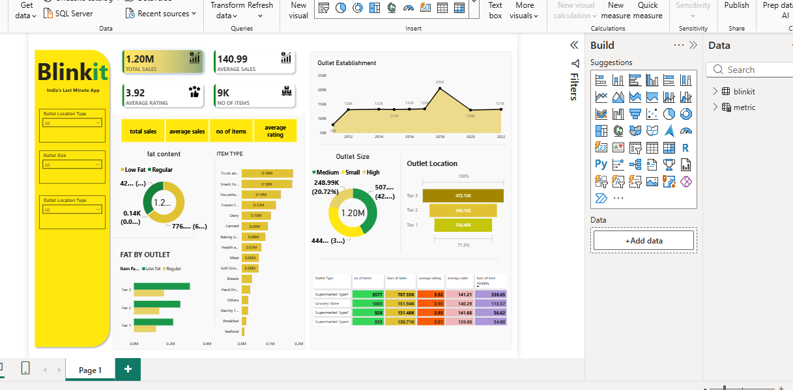

# 🛒 Blinkit Grocery Data Analysis & Power BI Dashboard

## 📊 Project Overview

This project presents an end-to-end **Blinkit Grocery Data Analysis** using **SQL, Excel, and Power BI**.

The objective of this project is to analyze sales performance, product categories, outlet characteristics, customer ratings, and item distribution to identify meaningful business insights and support data-driven decision-making.

The project includes **data cleaning using SQL, analytical queries, KPI calculations, and an interactive Power BI dashboard**.


---

## 🎯 Business Objective

The main objective is to understand:

* Overall sales performance
* Product category performance
* Impact of item fat content on sales
* Sales performance across outlet locations
* Impact of outlet size and type
* Outlet establishment trends
* Customer rating performance
* Item distribution and visibility

---


## 📁 Dataset

The dataset contains **8,523 records** and **12 columns**.

### Important Columns

| Column                    | Description                          |
| ------------------------- | ------------------------------------ |
| Item Fat Content          | Fat category of the product          |
| Item Identifier           | Unique product identifier            |
| Item Type                 | Product category                     |
| Outlet Establishment Year | Year in which outlet was established |
| Outlet Identifier         | Unique outlet identifier             |
| Outlet Location Type      | Tier 1, Tier 2 or Tier 3             |
| Outlet Size               | Small, Medium or High                |
| Outlet Type               | Grocery Store / Supermarket types    |
| Item Visibility           | Visibility percentage of the item    |
| Item Weight               | Weight of the product                |
| Total Sales               | Sales generated                      |
| Rating                    | Customer rating                      |

---

## 🧹 Data Cleaning

Before analysis, the **Item Fat Content** column was standardized.

Different values represented the same categories:

* `LF` → `Low Fat`
* `low fat` → `Low Fat`
* `reg` → `Regular`

This helped maintain consistency during aggregation, filtering and visualization.

The dataset also contains missing values in **Item Weight**, which were considered during the analysis.

---

# 📌 Key Performance Indicators (KPIs)

The dashboard contains four major KPIs:

### 💰 Total Sales

**$1.20M**

Total revenue generated across all records.

### 📈 Average Sales

**140.99**

Average sales value per record.

### 📦 Number of Items

**8.52K**

Total number of records/items represented in the dataset.

### ⭐ Average Rating

**~3.97**

Overall average customer rating.

---

# 📊 Power BI Dashboard

The interactive dashboard provides a consolidated view of Blinkit's sales and outlet performance.

### Dashboard Components

* KPI Cards
* Outlet Establishment Trend
* Sales by Fat Content
* Sales by Item Type
* Fat Content by Outlet
* Sales by Outlet Size
* Sales by Outlet Location
* Outlet Type Performance Table
* Interactive Filters/Slicers

### Dashboard Filters

Users can analyze the data using filters such as:

* Outlet Location Type
* Outlet Size
* Outlet Type

---

# 🔍 Business Analysis & Insights

## 1. Sales by Fat Content

After cleaning the data:

* **Low Fat products** contribute approximately **$776K** in sales.
* **Regular products** contribute approximately **$425K**.
* Low Fat products generate the larger share of total sales.

### Business Insight

Low Fat products have stronger overall sales contribution and can be considered an important category for inventory planning and promotional campaigns.

---

## 2. Sales by Item Type

The highest-selling product categories include:

1. **Fruits & Vegetables** – ~$178K
2. **Snack Foods** – ~$175K
3. **Household** – ~$136K
4. **Frozen Foods** – ~$119K
5. **Dairy** – ~$101K

### Business Insight

Fruits & Vegetables and Snack Foods are the strongest product categories by total sales and may deserve greater inventory availability and promotional focus.

---

## 3. Sales by Outlet Location

| Location | Approx. Sales |
| -------- | ------------: |
| Tier 3   |         $472K |
| Tier 2   |         $393K |
| Tier 1   |         $336K |

### Business Insight

**Tier 3 outlets generate the highest total sales**, followed by Tier 2 and Tier 1 outlets.

This indicates that outlet location and market characteristics can have an important impact on overall sales contribution.

---

## 4. Sales by Outlet Size

| Outlet Size | Approx. Sales | Sales Share |
| ----------- | ------------: | ----------: |
| Medium      |         $508K |      ~42.3% |
| Small       |         $445K |      ~37.0% |
| High        |         $249K |      ~20.7% |

### Business Insight

Medium-sized outlets generate the largest contribution to total sales.

This suggests that medium outlets may provide a strong balance between store capacity and customer demand.

---

## 5. Sales by Outlet Type

The strongest outlet type is:

**Supermarket Type 1 – ~$788K**

Followed by:

* Grocery Store – ~$152K
* Supermarket Type 2 – ~$131K
* Supermarket Type 3 – ~$131K

### Business Insight

Supermarket Type 1 is the dominant outlet format and contributes the majority of overall sales.

---

## 6. Outlet Establishment Analysis

The dashboard analyzes sales according to outlet establishment year.

The highest sales contribution is associated with outlets established in **1998**, generating approximately **$205K**.

### Business Insight

Older outlets can still demonstrate strong sales performance, suggesting that outlet maturity, established customer base and location may influence sales.

---

## 7. Customer Rating Analysis

The overall average rating is approximately **4.0**, indicating generally positive customer feedback.

Ratings remain relatively stable across different outlet and product categories.

### Business Insight

Customer satisfaction appears relatively consistent, so sales optimization can focus more heavily on product mix, outlet performance and inventory availability.

---

# 📈 Dashboard KPIs & Visualizations

The Power BI dashboard was designed to answer important business questions:

| Business Question                                       | Visualization |
| ------------------------------------------------------- | ------------- |
| What are the overall sales?                             | KPI Card      |
| What is the average sales value?                        | KPI Card      |
| How many records/items are available?                   | KPI Card      |
| What is the average rating?                             | KPI Card      |
| Which item categories generate highest sales?           | Bar Chart     |
| How does fat content affect sales?                      | Donut Chart   |
| Which outlet locations perform best?                    | Bar Chart     |
| Which outlet sizes generate more sales?                 | Donut Chart   |
| How have outlet sales changed over establishment years? | Line Chart    |
| Which outlet type performs best?                        | Matrix/Table  |
| How do Low Fat and Regular products perform by outlet?  | Bar Chart     |

---

# 📂 Project Structure

```text
Blinkit-Data-Analysis/
│
├── README.md
│
├── Data/
│   ├── BlinkIT Grocery Data.csv
│   ├── BlinkIT Grocery Data.xlsx
│   └── blinkit.json
│
├── SQL/
│   └── Query Doc (1).docx
│
├── PowerBI/
│   └── Blinkit Dashboard.pbix
│
├── Presentation/
│   └── Blinkit Analysis.pptx
│
└── Images/
    ├── Sales.png
    ├── Avg Sales.png
    ├── Items.png
    ├── rating.png
    └── background kpi.png
```

---

# 🚀 Project Workflow

```text
Raw Dataset
     ↓
Data Cleaning
     ↓
SQL Analysis
     ↓
KPI Creation
     ↓
Data Modeling
     ↓
DAX Calculations
     ↓
Power BI Visualization
     ↓
Business Insights
```

---

# 💡 Key Findings

* Total sales are approximately **$1.20M**.
* Average sales value is approximately **140.99**.
* The dataset contains **8,523 records**.
* Average customer rating is approximately **4.0**.
* **Low Fat** products generate the highest sales contribution after data standardization.
* **Fruits & Vegetables** and **Snack Foods** are the top-selling item categories.
* **Tier 3 outlets** contribute the highest sales among location tiers.
* **Medium-sized outlets** generate the highest sales contribution.
* **Supermarket Type 1** is the strongest outlet type by total sales.
* Customer ratings remain relatively stable across outlet categories.

---

# 👨‍💻 Author

Priyanshu Kashyap

MBA (Finance & IT) | Aspiring Data Analyst

### Skills

`SQL` `MySQL` `Excel` `Power BI` `DAX` `Data Analysis` `Git & GitHub`

---

## ⭐ Project Purpose

This project was created as a practical **Data Analytics portfolio project** to demonstrate the complete process of transforming raw grocery sales data into meaningful business insights using Power BI**.

If you found this project useful, consider giving the repository a ⭐ on GitHub.
